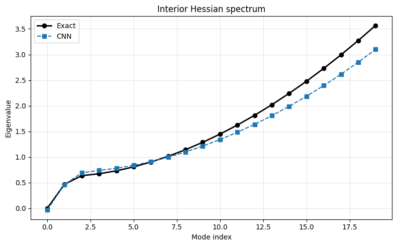
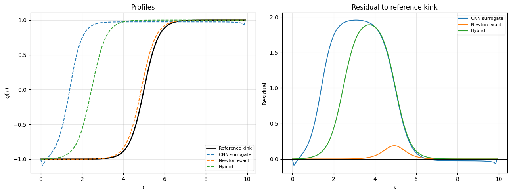

# Learning the Double-Well Action with a 1D CNN

A neural-network surrogate for the Euclidean action of the double-well theory, and an instanton finder that uses the trained surrogate as a warm-start for exact Newton refinement.

## What's here

| File | Purpose |
|---|---|
| `DoubleWell.py` | Discretised path integral: action, gradient, Hessian, Metropolis sampling. |
| `data_generator.py` | Samples instanton-cloud training data. |
| `cnn_architecture.py` | The 1D CNN. |
| `cnn_functions.py` | Training loop, evaluation, plots. |
| `train.py` | Trains the surrogate. |
| `instanton_finder.py` | Locates the instanton via CNN L-BFGS, exact Newton, and the hybrid. |

## Method

Small 1D CNN predicting $S[q]$ from a path configuration. Training combines three losses:

- MSE on action values
- MSE on the input-gradient $\nabla S_\theta$ (gradient matching)
- $\lVert\nabla S_\theta[q_{\text{cl}}]\rVert^2$ penalty at classical instantons (saddle-point pinning)

The $\mathbb{Z}_2$ symmetry $q \to -q$ is enforced via data augmentation.

## Usage

```bash
python data_generator.py      # writes to data/
python train.py               # set DATA_DIR, writes to results/
python instanton_finder.py    # set MODEL_PATH
```

Each script has a small configuration block at the top.

## Requirements

`torch`, `numpy`, `matplotlib`.

## Results

Hessian spectrum at the instanton — the surrogate matches the exact low-lying eigenvalues including the near-zero translational mode.



Recovered profiles — Newton and the hybrid both converge to valid instantons.



## Note

Reference implementation. Paper in preparation.

---

Niels van Venrooij — PhD candidate, University of Iowa 